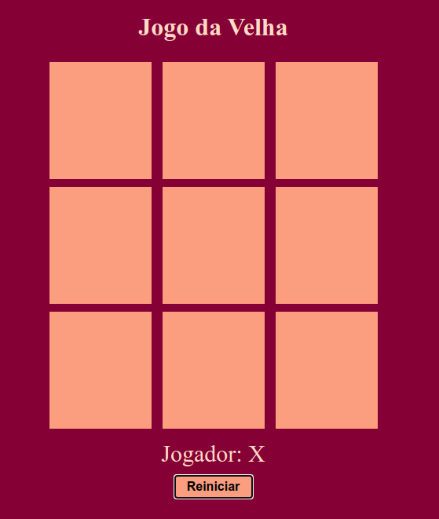

<h1 align="center">Jogo da velha</h1>

  
  
  

___

<h3 align="center">
  <a href="#information_source-sobre">Sobre</a>&nbsp;|&nbsp;
  <a href="#rocket-tecnologias-utilizadas">Tecnologias</a>&nbsp;|&nbsp;
  <a href="#link-como-contribuir">Como Contribuir</a>&nbsp;|&nbsp;
  <a href="#licença">Licença</a>
</h3>

___

  

 
 

## :information_source: Sobre

 Construção do jogo da velha no Bootcamp da Digial Innovation One, utilizando somente HTML para estruturar nosso site, CSS para estilizar e dar vida a ele, e Javascript para criarmos toda suas interações, desde a escolha do jogador, efetivar uma jogada e dar um vencedor ao jogo. 
 
 Serão abordados conceitos básicos sobre as linguagens e como podemos criar projetos bem simples sem muito trabalho, apenas utilizando suas funções básicas e uma pouco de lógica!

 Além do que foi dado no tutorial, acrescentei um modal para GameOver.

 
 

## :rocket: Tecnologias Utilizadas 

O projeto foi desenvolvido utilizando as seguintes tecnologias

- HTML5
- CSS3
- JavaScript

 
 

## :link: Como contribuir 

- Faça um Fork do repositório
- Clone o seu repositório
- Crie uma branch com a sua feature
- Faça um commit com suas mudanças
- 'Push' a sua branch
- Ir em Pull Requests do projeto original e criar uma pull request com o seu commit

 
 

## Licença 

Esse projeto está sob a licença MIT. Veja o arquivo [LICENSE](LICENSE) para mais detalhes.